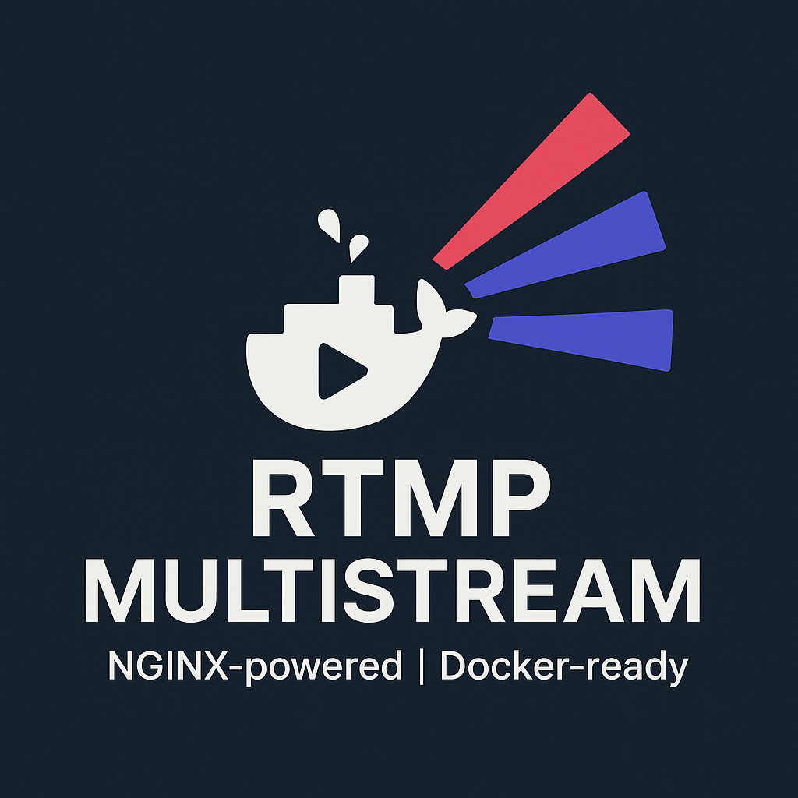
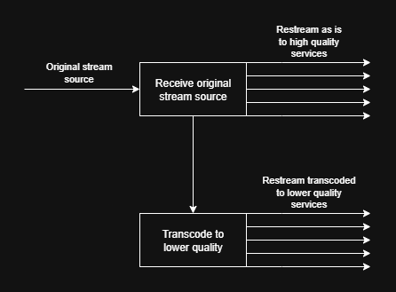

# qnub/docker-rtmp-multistream
This is a lightweight nginx-based RTMP relay/encoder forked from [JacobSanford/docker-rtmp-multistream](https://github.com/JacobSanford/docker-rtmp-multistream).

This version supports single treanscoding process which transalate transcoding result to many platforms. So it's lower server loading during translation.

It is intended to complement traditional streaming software (OBS, etc.) by providing a single endpoint that relays the stream simultaneously to multiple services (with transcoding if required), and archives it to a local disk.

This project works best if deployed on a dedicated PC, separate from the one running your streaming software.

[Prerequisites](docs/requirements.md) | [Quick Start Guide](docs/quickstart.md) | [Documentation](docs/README.md)

## Supported Streaming Services
* KICK: [Advanced Twitch Configuration](docs/services/kick.md)
* Twitch: [Advanced Twitch Configuration](docs/services/twitch.md)
* YouTube: [Advanced YouTube Configuration](docs/services/youtube.md)
* Archive (local disk): [Advanced Local Archive Configuration](docs/services/archive.md)

New/Additional services can easily be added. Please see the [Adding New Services](docs/services/new.md) documentation.

## Issues
Please report any issues or bugs you encounter by opening a new issue via the [Issues tab](https://github.com/qnub/docker-rtmp-multistream/issues).

## Contributions
Contributions / Pull requests are welcome!

## License
MIT
